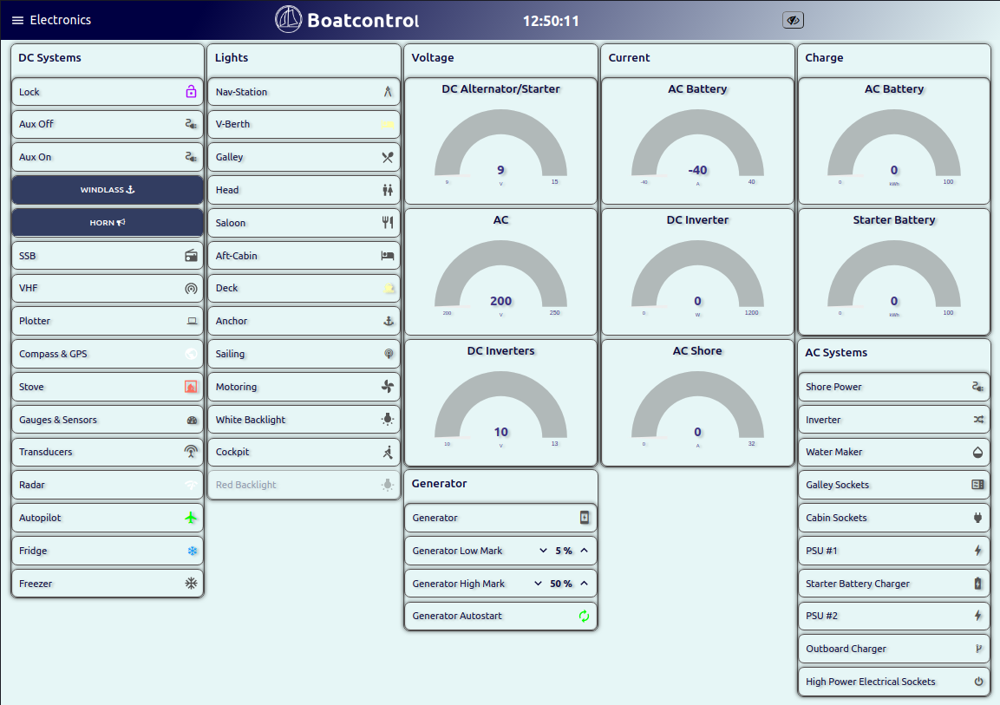

# WORK IN PROGRESS, NOT PRODUCTION READY!

# Boatcontrol

## About

Boatcontrol is an open hardware design for a marine grade smart/IoT electrical
distribution panel and electronics platform (boat) controller.

It's an I/O breakout board capable of switching up to 48 Latching relays or 32
Latching relays and 32 regular relays with individual circuits up to 60A and
compatible with both DC and AC current.

The "smart" part is provided by either a **Raspberry Pi** HAT or an
**Nvidia Jetson** (Nano/Xavier NX) either of which can be mounted on the board.

All critical parts are designed to be field serviceable, components using
through-holes are used where possible for better durability in mobile marine
environment. Note that these boards need to carry significant amounts of current
and high voltage and as such PCB thickness and clearances are CRITICAL along
with proper thermal management.

Special care has been taken to limit idle power consumption wherever possible, on
it's own the board will only consume {INSERT_WATTS} watts while idle, if a
Raspberry Pi (RPi) Zero is mated it will add 400 Milliwatts, a fully fledged RPi 4
with all the bells and whistles will add up to 3.4 Watts, a Jetson Xavier NX
will bring the total to 10-15 Watts depending on configuration. Jumpers are
provided where applicable to disable LEDs to reduce power consumption when idle.

Effort was taken to make the boards as reliable as possible and enable them to
be operated in emergencies and under failure conditions. All circuits can be
operated manually on the board as long as the board has a power source over 6v
and below 30v (see optional 12V vs 24V operation and PSU).
Operation using external 5V TTL inputs via the RJ45 connectors is
available regardless of the state or presence of the RPi/Jetson.

The board can be set to run in either 12V or 24V mode, for operation
over 13V please make sure the optional 12V PSU components are in place and
the appropriate solder jumpers bridged.
For 12V operation make sure the 12V bypass jumper/solder pads are bridged.

## PCB Stack & Manufacturing

The design includes a main board and (at the time of launch) two optional addon
boards, the primary board is designed for 4 layer 2.4-3.2mm PCBs with the following sizes/layers:

#### Main board - 536mm x 308mm (just over 21" x 12")
* Front Power, 6oz (220um) copper, min spacing 0.500mm)
* First Signal, 1oz (35um) copper, min spacing 0.250mm)
* Second Signal, 1oz (35um) copper, min spacing 0.250mm)
* Back Power, 6oz (220um) copper, min spacing 0.500mm)

#### Addon boards - 153mm x 106mm (just over 5" x 4")
* The high current daughter board is designed for 4 layer 1/13oz (35/450um) copper.
* The non-latching daughter board is designed for 4 layer 1/6oz (35/200um) copper.
* The non-existent current sensing daughter board .. will probably use 6oz copper.
* The non-existent ESD optocoupler/isolator board .. will probably use 1oz copper.

PCB Stack Thickness of daughter boards can vary as long as they are over 1mm

It's important that the power layers are on the outside for cooling purposes,
internal layers would require substantially thicker copper layers.

There aren't very many PCB manufacturers around that will/can produce a board
like this, especially in small quantities and the tooling fee will be a
substantial part of the total cost.

At the time of writing I would estimate at least $400 USD for tooling
setup and then $350 USD for each board manufactured. The manufacturers that
have online order forms for 4 layer heavy copper PCBs are:

* https://www.pcbcart.com
* https://www.pcbway.com
* https://pcbgogo.com

Note that these costs are only for the PCB, not for assembly or parts.

## Enclosure

Any reasonably sized enclosure will work but this board was designed to fit in
the **Fibox PC 5638 18T** with the optional steel mounting plate (which will need
to be drilled).

This should give a rating of IP65/IK09

https://www.fibox.com/catalog/product/2393/2539557_ENG3.pdf

All cables should be installed with cable glands and drip loops, only install
cable glands on the bottom and optionally sides of the box, avoid making any
holes in the side facing up.

## Components, features and Bill of Materials

The components required to fully populate the board will typically cost around
{INSERT_BOM_COST}, here are full BOM carts from Mouser and DigiKey.

* {INSERT_LINK_TO_DIGIKEY}
* {INSERT_LINK_TO_MOUSER}

### Switches
Onboard switches can be momentary or locking depending on preference and application.
Typically one would use momentary switches for latching relays and locking
switches for non-latching relays.* For operating things like bilge pumps or
other devices that should only be turned on momentarily it might be beneficial
to use a non-latching relay with a momentary push button.

If for some reason locking switches are used with latching relays care must be
taken since most latching relay coils can't withstand being energized for long
periods and ideally should only be energized for less than a second*

The onboard switches are primarily for use in emergencies and debugging and while
they do provide protection against powering two coils in the same relay at the
same time they do not restrict the time a coil is energized unlike the RJ45 or
GPIO inputs.

All DPDT E3 series switches from Panasonic should work such as the ESB30 and ESB33
series, note that locking ESB30 switches can be converted to momentary
operation very easily even after soldering.

*The only exception to this would be if a user wants
to be able to physically disable a particular relay/circuit in which case two
locking relays can be used, if both of them are engaged at the same time they
will prevent all signals from reaching a latching relay behind them and at the
same time prevent each other from energizing the relay.

### Circuit breakers

The Schurter T9-818 breakers are  available in 3-15A current ratings and can
handle up to 48VDC and up to 240VAC.

The main board has a total of 32 breakers in 3 bank configurations, the board
can be outfitted with any configuration of breakers as long as the total does
not exceed 60A per bank or if a bank exceeds 60A then it should be protected by an
external 60A AC or DC breaker.

### The main (base) board layout includes sockets/circuits for:

#### 16 x 0-24V DC Common input channels/circuits:
* Input polarity protection and indicator LED
* Latching relay rated for 24V DC
* Thermally fused to 3A (can be swapped for 6A, 10A and 16A)
* Total current of these circuits should not exceed 60A

#### 8 x 0-24V DC Common input channels/circuits:
* Input polarity protection and indicator LED
* Latching relay rated for 24V DC
* 4 x thermally fused to 6A (can be swapped for 6A, 10A and 16A)
* 2 x thermally fused to 10A (can be swapped for 6A, 10A and 16A)
* 2 x thermally fused to 16A (can be swapped for 6A, 10A and 16A)
* Total current of these circuits should not exceed 60A

#### 8 x 100-250V AC Common input channels/circuits:
* AC Live/Neutral indicator LED
* Latching relay rated for 24V DC
* 4 x thermally fused to 6A (can be swapped for 6A, 10A and 16A)
* 2 x thermally fused to 10A (can be swapped for 6A, 10A and 16A)
* 2 x thermally fused to 16A (can be swapped for 6A, 10A and 16A)
* Total current of these circuits should not exceed 60A

## Addon boards
Addon boards connect to the main board using a 2 x 20 female pin header.
The main board male connectors are reversed compared to the GPIO header to avoid
confusion and prevent RPis or Jetson boards from being accidentally connected to
an addon-board header.

### Latching Relay Addon Board:
* 8 x 0-277V AC/DC Individual input/output channels/circuits
* Individual channel current should not exceed 60A
* No circuit breakers, polarity indicators or protection

### Non Latching Paired Addon Board:
* 16 (8 pairs*) x 12V DC non latching input/output channels/circuits
* Individual channel current should not exceed 32A
* No circuit breakers, polarity indicators or protection

_Non-latching Relays are paired and only one of a pair can be powered at any given time._

_All relays on a board share a common "Anode"/"Cathode", make sure to
adjust the solder-jumpers on the backside for the type of relays used so that
the relay polarity is correct. and that the correct transistor array chosen
(ULN2803A vs. TBD62783APG)_

Keep in mind that there is no requirement to fully populate the board and a partially
populated board is a great way to plan for future expansions given that the
board is field serviceable assuming the heavy copper soldering is done.

## Modes of operation
Each channel/circuit can be controlled using three different methods:

1. Using the onboard switches (these directly energize the relay coils)

2. Using two external switch signals wired up using CAT5/6 with RJ45
connectors. The signals use 5V TTL logic and are active HIGH.
The signals are filtered for noise and duration to protect the relays,
this ensures that only one coil can be energized at any given time and
only for a period of 1 second. Due to this filtering these can be safely
wired to 3-way "Latching" wall/panel switches or momentary push buttons.

3. Using I2C via the 2x20 Header, typically this would be done using a
Raspberry Pi (RPi) or Nvidia Jetson, for power efficiency consider using a RPi Zero.
See Node-Red source for IoT web based interfaces that can run on these platforms.

* Onboard bi-colour LEDs indicate coil energy state and pulses to "ON"/"OFF" coils.
* For latching relays RED indicates the circuit being turned ON while GREEN indicates the circuit being turned OFF.
* For non-latching relays RED and GREEN each represent a separate relay in a pair.

## Technical details

While the scale is disproportionate the main board is really just a rather large
Raspberry Pi HAT though it does not require an RPi to operate.
__Note that the board will act as a power supply for the RPi and Jetson
Nano and eliminates the need for a separate PSU to power the RPi/Nano.__
__Nvidia Jetson Xavie Xavier products such as the NX and AGX will still need a separate (19V)
power source.__

All communication between the RPi and the board is done using I2C, this only
requires 2 pins/wires and makes it safe to use in combination with most if not all
other HATs. In particular it can co-exist with the Moitessier HAT though you
might want to run your chart-plotting or navigation software on a separate
RPi/Jetson NX and have a dedicated micro-computer for controlling your electrical system.

### RJ45 Connectors & Remote I/O
The top/right RJ45 connector is used to remotely control relays on the main
board. Each RJ45 socket controls 2 latching relays or 2 non-latching relay pairs (4).
Every socket consists of 4 separate 5V supply pins supplied via a 10KΩ resistor.
For long cable runs the resistor banks on the back can be replaced with lower
resistance values.

Half of the bottom/left RJ45 connector is used to remotely control addon boards.
Each RJ45 socket can control 4 channels, typically controlling 2 latching relays
or 2 non-latching relay pairs (4). **Note that there are no resistors so current
is only limited by what the onboard PSU can supply and shorting this can
de-power the RPi/Jetson!**

**Note that pairing is important for all RJ45CAT5/6 wiring, it's highly
recommended that the source/sink to control each relay uses a twisted pair,
this will minimize loss and interference. Pairs are typically colored as shown here**

_Advanced uses may also include shielding but this is beyond the scope of this document._

*IMPORTANT* - Note that RJ45 Inputs are not isolated or protected from ESD, if there is any
chance of surges or high voltages these should be isolated from the board using
digital isolators or optocouplers and transient voltage suppressors. For remote
installations of the Raspberry Pi/Jetson you might also want to add debounce
and provide 3v from an isolated source.

#### 12V "High Voltage/Current" Pins
There are 16 extra IO pins that can provide up to 500mA each, this is provided
using an MCP23017 and a ULN2803* with a clamp diode. Examples of use cases would
be external relays, solenoids, small motors, high power LEDs, Cameras, etc.

_*can be substituted with a TBD62783APG to swap polarity_

#### Raspberry Pi / Jetson  I/O
All pins from the GPIO header are made available via RJ45 to allow easy
expansion and remote mounting of devices such as GPS and AIS devices.

_Note that the 5V pins are shared with the RPi and maximum currents governed by
the RPi design not the Boatcontrol._

_Note that no additional protection or filtering is provided, the pins are
simply mapped from the RPi GPIO header directly to RJ45 without any provision
to minimize signal degradation or distortion._

_Note that this includes the I2C bus which can be used to communicate directly
with all devices on the main and addon boards_

### RPi HAT / Jetson GPIO Interface
Using the GPIO header there are two ways to connect an RPi or Nvidia Jetson
device to the board.
1. Install female pin header on the Boatcontrol, mount the device directly in
the upside down position, if you choose this option make sure the particular board you are mounting has
enough clearance.*
2. Install a male pin header on the Boatcontrol, mount the device using a
   ribbon cable.

*While the RPi Zero is guaranteed to fit and with long headers all the
Pi/Pi2/Pi2/Pi4s should fit you should make sure your device fits before
choosing this mounting method.

_If using a Jetson Xavier NX or AGX make sure you use the horizontal inductors for the
PSU since the vertical arrangement can block one of the mounting holes._

### Addon cards

### I2C interface and addresses
The I2C addresses of the IO Expanders can be modified* using solder jumpers on
the backside of the PCB but the defaults are:

    0x20 (32) 3A Common Input DC #1-8
    0x21 (33) 3A Common Input DC #9-16
    0x22 (34) 6/10/16A Common Input DC
    0x23 (35) 6/10/16A Common Input AC
    0x24 (36) 60A Individual AC/DC
    0x25 (37) Additional IO #1 to RJ45 Cat5/6
    0x26 (38) Additional IO #2 to RJ45 Cat5/6

*Bring plenty of watts, it's a 6oz PCB!

# Software
One of the primary advantages of having the GPIO interface and using a
Raspberry Pi or Nvidia Jetson to interface with the board is the simplicity and
ease of use allowing each installation to be customized for the particular boat
and users, changes can be made in real-time using a web browser and all the
functionality and features are accessible from any web enabled device onboard
or remote.

The following are screenshots from development UIs used to debug and test the
hardware, they show some of the functionality that's possible even though the
user interface and graphics need a lot more work and polish.

This particular interface is built using Node-Red and is running on an RPi 4.

# Open Hardware

Feel free to modify this to suit your own needs or have it made as it's
currently configured. Be careful when upgrading circuit breakers to not exceed the
current/thermal capacity of the board. If you use thinner copper than 6oz make
sure to appropriately downgrade the thermal breakers to reduce maximum current.

## Bus bars, jumper wires and 2 layer boards

Depending on where you live and your requirements it might make more sense
for you to use laser cut copper bus bars or solder wires on the back of your PCB to
avoid the expensive 6oz copper layers.

The PCB was architected to facilitate 1oz / 2 layer construction, there is a
git branch called [2layer](../../tree/2layers) which is the last version supporting 2 layers. *In
theory* this could be made with 1oz copper and used with bus bars or jumper
wires but it's not been kept up to date. Let me know if you want to use this
and we can probably work together to merge relevant changes.

## Key design decisions and parameters

* All critical components are through-hole for field maintenance on moving platforms and secure attachment for vibration and G loads.
* All relays can be controlled from either the RPi/Nvidia or using analog control signals via RJ45/CAT5/6 connectors/cables.
* All onboard relays are latching dual coil with individual control circuits.
* All analog input channels have pulse generators for the relays to protect them from overheating.
* Built-in high efficiency 5/12v step down converters to power the RPi/Nano and logic components and supply current for analog control.
* 8x 3-16A 250V AC shared bus protected circuits
* 24x 3-16A 12-24V DC shared bus protected circuits
* 32x 12-24V 500mA DC Logic/Relay breakout via RJ45
* Optional 16x 250V AC non-latching unprotected add-on board
* Optional 8x 60A 277V AC latching individual unprotected add-on board
* All onboard DC channels are polarity protected with high efficiency PFETs
* Protection is provided using thermal circuit breakers, the permitted amperage can be changed by switching out breakers, no breakers are provided for the 60A circuits, suggest using external breakers.
