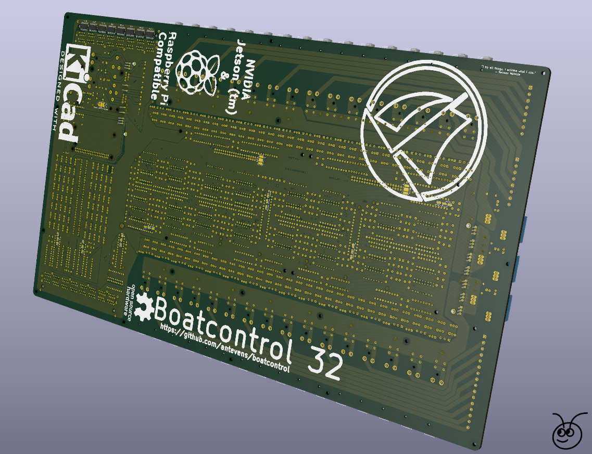

WORK IN PROGRESS, NOT PRODUCTION READY!

# About

This is an open hardware design for a marine grade smart/IoT electrical
distribution panel and electronics platform (boat) controller.

You can think of this as a giant latching relay board with a socket to act like
a regular Raspberry Pi HAT or an Nvidia Jetson (Nano/Xavier NX) breakout

All critical parts are designed to be field servicable, components using
through-holes are used where possible for better durability in mobile marine
environments. Note that these boards need to carry significant amounts of current
(up to 660 Amperes!) and voltage (max 277V) and as such PCB thickness and
clearances are CRITICAL along with proper thermal management.

Special care has been taken to limit power consumption wherever possible, on
it's own the board will only consume {INSERT_WATTS} watts when idle, if a
Raspberry Pi (RPi) Zero is mated it will add 80mA, a fully fledged RPi 4
with all the bells and whistles will add up to 3.4 Watts, a Jetson Xavier NX
will bring the total to 10-15 Watts depending on configuration. Jumpers are
provided where applicable to disable LEDs to reduce power consumtion when idle.

Effort was taken to make the boards as reliable as possible and enable them to
be operated in emergencies and under failure conditions. All circuits can be
operated manually on the board as long as the board has a power source over 6v
and below 30v depending on configuration (see optional 12V vs 24V operation and
PSU). Operation using external 5V TTL inputs via the RJ45 connectors is 
available regardless of the state or presence of the RPi/Jetson.

The board can be configured to run in either 12V or 24V mode, for operation
over 13V please make sure the optional 12V PSU option is in place and
configured. For 12V operation make sure the 12V bypass jumper/solder pads are
connected.

IMPORTANT - Note that RJ45 Inputs are not isolated or protected from ESD, if there is any
chance of surges or high voltages these should be isolated from the board using
digital isolators or optocouplers and transient voltage suppressors. For remote
installations of the Raspberry Pi/Jetson you might also want to add debounce
and provide 3v from an isolated source.

# PCB Stack & Manufacturing

The design includes a main board and (at the time of launch) two optional addon
boards, the primary board is designed for 4 layer 2.4-3.2mm PCBs with the following layers:

    Front Power, 6oz (220um) copper, min spacing 0.500mm)
    First Signal, 1oz (35um) copper, min spacing 0.250mm)
    Second Signal, 1oz (35um) copper, min spacing 0.250mm)
    Back Power, 6oz (220um) copper, min spacing 0.500mm)

    The high current daughter board is designed for 4 layer 1/13oz (35/450um) copper.
    The non-latching daughter board is designed for 4 layer 1/6oz (35/200um) copper.
    The non-existent current sensing daughter board .. will probably use 6oz copper.
    The non-existent ESD optocoupler/isolator board .. will probably use 1oz copper.

    PCB Stack Thickness of daughter boards can vary as long as they are over 1mm

It's important that the power layers are on the outside for cooling purposes,
internal layers would require substancially thicker copper layers.

There aren't very many PCB manufacturers around that will/can produce a board
like this, especially in small quantities and the tooling fee will be a
substancial part of the total cost.

At the time of writing I would estimate at least $400 USD for tooling
setup and then $350 USD for each board manufactured. The manufacturers that
have online order forms for 4 layer heavy copper PCBs are:
    * https://www.pcbcart.com
    * https://www.pcbway.com
    * https://pcbgogo.com

Note that these costs are only for the PCB, not for assembly or parts.

# Components, features and Bill of Materials

The components required to fully populate the board will typically cost around
{INSERT_BOM_COST}, here are full BOM carts from Mouser and DigiKey.

    * {INSERT_LINK_TO_DIGIKEY}
    * {INSERT_LINK_TO_MOUSER}

Note that there is no requirement to fully populate the board and a partially
populated board is a great way to plan for future expansions given that the
board is field servicable.

The main (base) board layout includes sockets/circuits for:

16 x 0-24V DC Common input channels/circuits with the following:

    * Input polarity protection and indicator LED
    * Latching relay rated for 24V DC
    * Thermally fused to 3A (can be swapped for 6A, 10A and 16A)
    * Total current of these circuits should not exceed 60A

8 x 0-24V DC Common input channels/circuits with the following:

    * Input polarity protection and indicator LED
    * Latching relay rated for 24V DC
    * 4 x thermally fused to 6A (can be swapped for 6A, 10A and 16A)
    * 2 x thermally fused to 10A (can be swapped for 6A, 10A and 16A)
    * 2 x thermally fused to 16A (can be swapped for 6A, 10A and 16A)
    * Total current of these circuits should not exceed 60A

8 x 100-250V AC Common input channels/circuits with the following:

    * AC Live/Neutral indicator LED
    * Latching relay rated for 24V DC
    * 4 x thermally fused to 6A (can be swapped for 6A, 10A and 16A)
    * 2 x thermally fused to 10A (can be swapped for 6A, 10A and 16A)
    * 2 x thermally fused to 16A (can be swapped for 6A, 10A and 16A)
    * Total current of these circuits should not exceed 60A

# Addon boards

Latching Relay Addon Board:

8 x 0-277V AC/DC Individual input/output channels/circuits
    * Individual channel current should not exceed 60A
    * No circuit breakers, polarity indicators or protection

Non Latching Paired NO Addon Board:

16 (8 pairs) x 12V DC non latching input/output channels/circuits
    * Individual channel current should not exceed 32A
    * No circuit breakers, polarity indicators or protection
    * NOTE, relays are paired and only one of a pair can be powered
    * at any given time.

Note that while each addon board has 16 individual control signals they are
grouped in 8 pairs and all pairs share a common "Anode"/"Cathode", make sure to
adjust the solder-jumpers on the backside for the type of relays used so that
the relay polarity is correct.

# Modes of operation

Each channel/circuit can be controlled using three different methods:

    1. Using the onboard switches (these directly energize the relay coils)

    2. Using two external switch signals wired up using CAT5/6 with RJ45
       connectors. The signals use 5V TTL logic and are active HIGH.
       The signals are filtered for noise and duration to protect the relays,
       this ensures that only one coil can be energized at any given time and
       only for a period of 1 second. Due to this filtering these can be safely
       wired to 3-way "Latching" wall/panel switches or momentary push buttons.

    3. Using I2C via the 2x20 Header, typically this would be done using a
       Raspberri Pi (RPi) or Nvidia Jetson, for power efficency consider using a RPi Zero.
       See Node-Red source for IoT web based interfaces that can run on these
       platforms.

Onboard bi-colour LEDs indicate coil energy state and pulses to "ON"/"OFF" coils.
For latching relays RED indicates the circuit being turned ON while GREEN indicates the circuit being turned OFF.
For non-latching relays RED and GREEN each represent a separate relay in a
pair.

# Technical details

This might also be considered a Raspberry Pi hat making it the largest one in
existence but the board does not require an RPi to operate.
Note that the board will act as a power supply for the RPi and Jetson
Nano and eliminates the need for a separete PSU to power the RPi/Nano.
Nvidia Jetson products such as the NX and AGX will still need a separate (19V)
power source.

All communication between the RPi and the board is done using I2C, this only
requires 2 wires and makes it safe to use in combination with most if not all
other hats. In particular it can co-exist with the Moitessier HATs though you
might want to run your chart-plotting or navigation software on a separate
RPi/Jetson NX and have a dedicaded micro-computer for controlling your electrical system.

I2C interface and addresses
    The I2C addresses of the IO Expanders can be modified using solder
    jumpers on the backside of the PCB but the defaults are:

    0x20 3A Common Input DC #1-8
    0x21 3A Common Input DC #9-16
    0x22 6/10/16A Common Input DC
    0x23 6/10/16A Common Input AC
    0x24 60A Individual AC/DC
    0x25 Additional IO #1 to RJ45 Cat5/6
    0x26 Additional IO #2 to RJ45 Cat5/6

Extra pins/IO on Cat5/6 via the RJ45 Connectors
    In addition to the 5V TTL active-low signals to control the relays there
    are a couple of aditional IO ports and pins available via RJ45.

    All the RPI pins
    {INSERT_PINOUT_HERE}

    Two Extra MCP23017 TTL outputs

Feel free to modify this to suit your own needs or have it made as it's
currently configured. Be careful when upgrading circuit breakers to not exceed the
current/thermal capacity of the board. If you use thinner copper than 6oz make
sure to appropriately downgrade the thermal breakers to reduce maximum current.

# Software

For examples of how to use Node Red to control this board see
    {INSERT_NODE_RED_LINK_HERE}
    {INSERT_NODE_RED_DEMO_HERE}

# Key design decisions and parameters

* All critical components are through-hole for field maintenance on moving platforms and secure attachment for vibration and G loads.
* All relays can be controlled from either the RPi/Nvidia or using analog control signals via RJ45/CAT5/6 connectors/cables.
* All onboard relays are latching dual coil with individual control circuits.
* All analog input channels have pulse generators for the relays to protect them from overheating.
* Built-in high efficiency 5/12v step down converers to power the RPi/Nano and logic components and supply current for analog control.
* 8x 3-16A 250V AC shared bus protected circuits
* 24x 3-16A 12-24V DC shared bus protected circuits
* 32x 12-24V 500mA DC Logic/Relay breakout via RJ45
* Optional 16x 250V AC non-latching unprotected add-on board
* Optional 8x 60A 277V AC latching individual unprotected add-on board
* All onboard DC channels are polarity protected with high efficiency PFETs
* Protection is provided using thermal circuit breakers, the permitted amperage can be changed by switching out breakers, no breakers are provided for the 60A circuits, suggest using external breakers.
